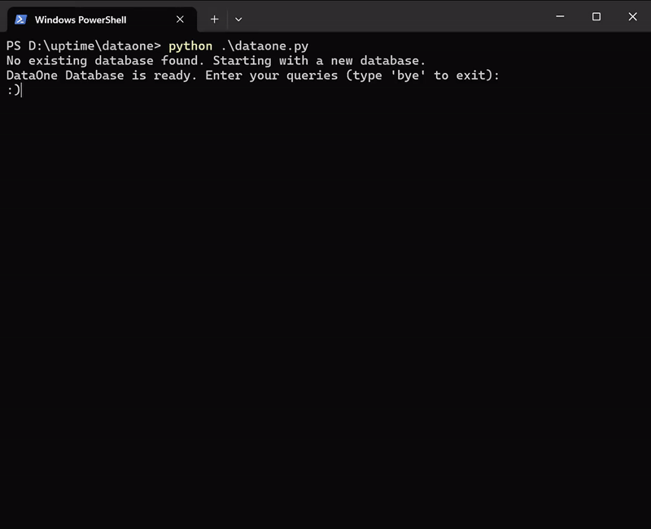

# DataOne Database System

**DataOne** is a lightweight, file-based database management system that allows you to perform essential database operations like creating tables, inserting, updating, deleting, and querying records. It also supports transactions, table joins, and custom query execution.

---

## WHY dataone
DataOne is the best choice for developers and teams who need a simple, efficient, and lightweight database system that supports basic CRUD operations, data integrity, and data compression. It’s ideal for small to medium-scale applications, educational purposes, and projects where ease of use and portability are important. With its extensible architecture and no reliance on heavy DBMS systems, DataOne provides a solid foundation for building applications without the overhead of complex database administration.

## **Features**

- **Custom Query Language**
  - Human-readable commands like `build`, `add`, `change`, `kick out`, and `mix it up` for database operations.

- **Data Types Supported**
  - `INT`, `FLOAT`, `BOOLEAN`, `DATE`, `CHAR`, `TEXT`, and `STRING`.

- **Transaction Management**
  - Begin, commit, and roll back transactions for safer data handling.

- **File-Based Storage**
  - Data is stored locally in a compressed format using `pickle` and `zlib`.

- **Table Joins**
  - Perform joins on tables to merge data based on a common column.

- **Persistence**
  - Automatically saves changes to the database file and reloads from storage on startup.

- **Customizable Schema**
  - Define table schemas with primary keys and data types for each column.

---

## **Usage Guide**


### **Basic Commands**

#### 1. Create a Table
```markdown
build <table_name> <column1> <type1> <column2> <type2> ... [primarykey <column_name>]
```
Example:
```markdown
build users id int name text age int primarykey id
```
#### 2. Insert a Record
```markdown
add in <table_name> <column1> <value1> <column2> <value2> ...
```
Example:
```markdown
add in users id 1 name "John Doe" age 30
```
#### 3. Update a Record
```markdown
change <table_name> <record_id> <column1> <value1> ...
```
Example:
```markdown
change users 1 name "Jane Doe" age 32
```
#### 4. Delete a Record
```markdown
kick out <table_name> <record_id>
```
Example:
```markdown
kick out users 1
```
#### 5. Show Table
```markdown
show <table_name>
```
Example:
```markdown
show users
```
#### 6. Join Tables
```markdown
mix it up <table1> <table2> <column>
```
Example:
```markdown
mix it up orders users id
```

### Technical Details

#### Schema Handling

* Column definitions include data types for automatic type conversion.
* Primary key enforcement ensures data integrity.

#### File Storage

* Data is serialized using pickle and compressed with zlib for efficient storage.

#### Error Handling

* Provides detailed error messages for invalid queries or schema mismatches.

#### Transaction Management

* Allows grouping multiple operations and rolling back if needed.


### Contributing

We welcome contributions! Feel free to submit pull requests or raise issues for enhancements and bug fixes.

### License

This project is licensed under the MIT License. See the LICENSE file for more details.

### Enjoy using DataOne! 😊
